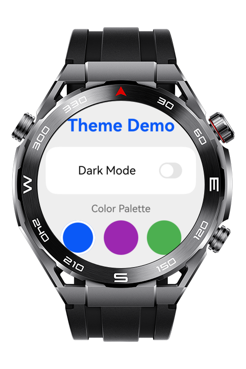
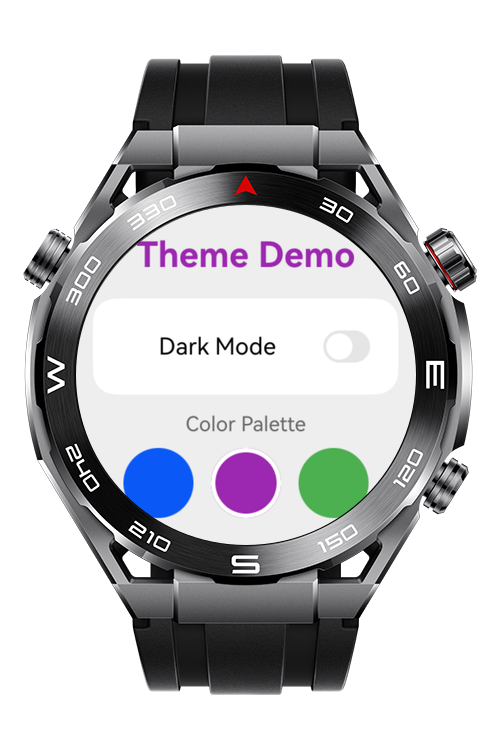
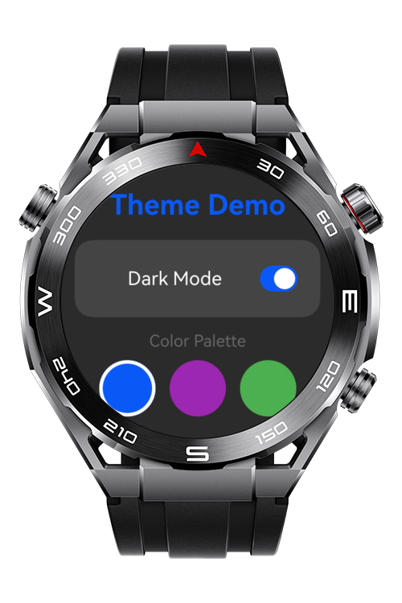
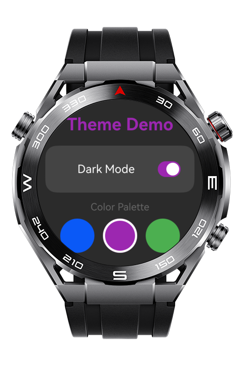

> **Note:** To access all shared projects, get information about environment setup, and view other guides, please visit [Explore-In-HMOS-Wearable Index](https://github.com/Explore-In-HMOS-Wearable/hmos-index).

# How to use Theme

You can refer this application to learn how to use theme features for Huawei Smart Watch models.

# Preview

<p style="align: left;">
  
  
  
  
</p>

# Use Cases

- Implementing dark and light mode switching for wearable applications
- Creating custom theme colors with multiple palette options
- Adapting UI components to different color modes automatically
- Using WithTheme for page-level theme customization

# Tech Stack

- **Languages**: ArkTS
- **Frameworks**: HarmonyOS SDK "6.0.1(21)"
- **Tools**: DevEco Studio Vers 6.0.1
- **Libraries**: @kit.ArkUI

# Directory Structure

```
entry
│   
├───src
│   └───main
│       ├───ets
│       │   ├───entryability
│       │   │       EntryAbility.ets
│       │   │
│       │   ├───pages
│       │   │       Index.ets
│       │   │
│       │   └───theme.ets
│       └───resources
│           ├───base
│           │   └───element
│           │           color.json
│           │
│           └───dark
│               └───element
│                       color.json
```
 
# Constraints and Restrictions

## Supported Devices

- Huawei Watch 5

# LICENSE

This app is distributed under the terms of the MIT License.
See the [LICENSE](/LICENSE) for more information.